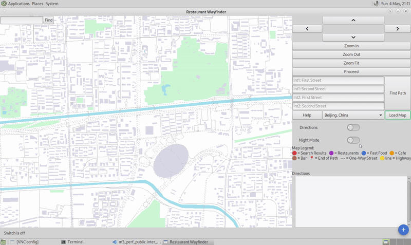
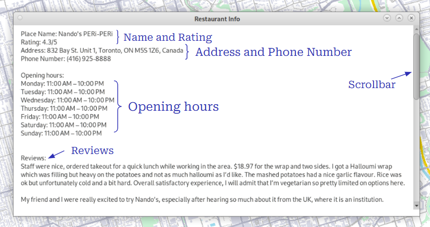

### ⚠️ This repository contains only media and documentation due to course policy — source code is not publicly shared.

# 🚀 Project Overview
The goal of this project was to build a fast, interactive Geographic Information System (GIS) for restaurant exploration and navigation. Designed and implemented over the semester in a team of three, the application supports full restaurant search, dynamic UI rendering, and advanced route optimization — entirely from scratch using C++ and EZGL.

## 🖥️ Core Features (with Live Demos)
### 🔍 Autocomplete Search Bar
Case-insensitive, space-insensitive search for food-related POIs. Designed based on human scanning habits — placed at the top-left for usability.

### 🗺️ Clickable Intersections
Click on any two intersections to get the shortest route between them using A*.

### 🌐 Multi-City Map Support
Explore maps from around the world with smooth panning and zooming.

### 🌙 Night Mode
Toggle between light and dark modes for reduced eye strain.

### 🧠 Typed Intersection Search
Quickly search for intersections by typing both street names — even partial matches are supported.

### 📍 Live Restaurant Information
Instant pop-up with address, ratings, opening hours, and reviews. Allows users to stay on the map for key information.

## ⚙️ Technical Highlights

### Pathfinding Algorithms:
- Implemented Dijkstra’s and A* for route search between intersections.
- Designed multi-destination Dijkstra for courier optimization.
- Used Greedy + Multi-Start + 2-Opt + Simulated Annealing to refine delivery paths.

### Performance Optimization:
- Preloaded roads, curves, features, and name positions into memory for real-time drawing.
- Implemented zoom-based detail rendering to reduce clutter and boost frame rate.

### Graphics and UI:
- Built custom UI in EZGL (on top of GTK), including scrollable, text-wrapped restaurant review windows.
- Used Boost Property Trees to parse Google Places API JSON data for live restaurant info.

### Team Collaboration:
- Managed source control and collaboration using Git, with strong commit hygiene and merge practices.

## 🧠 Skills Gained
- C++ graphics programming with EZGL & GTK
- Design and implementation of classical pathfinding algorithms
- Real-time map rendering and UI responsiveness
- JSON parsing and external API integration (Google Places)
- Collaborative Git workflows in a 3-person team

## 💡 Key Challenges + Solutions
- Efficient Rendering: Drawing hundreds of streets and names per frame caused lag. Solved by precomputing map features and using zoom-dependent rendering logic.
- Courier Routing: Creating a performant solution to the traveling courier problem required combining algorithms: greedy construction, local optimization (2-opt), and probabilistic search (simulated annealing).
- Custom GTK UI: Displaying dynamic text like restaurant reviews in scrollable boxes required building a custom component with text wrapping, scrollbar logic, and theme consistency.
